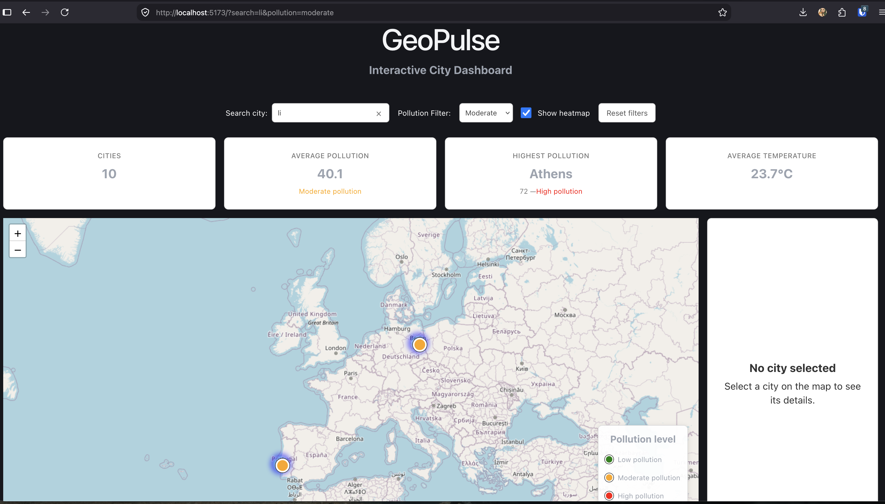
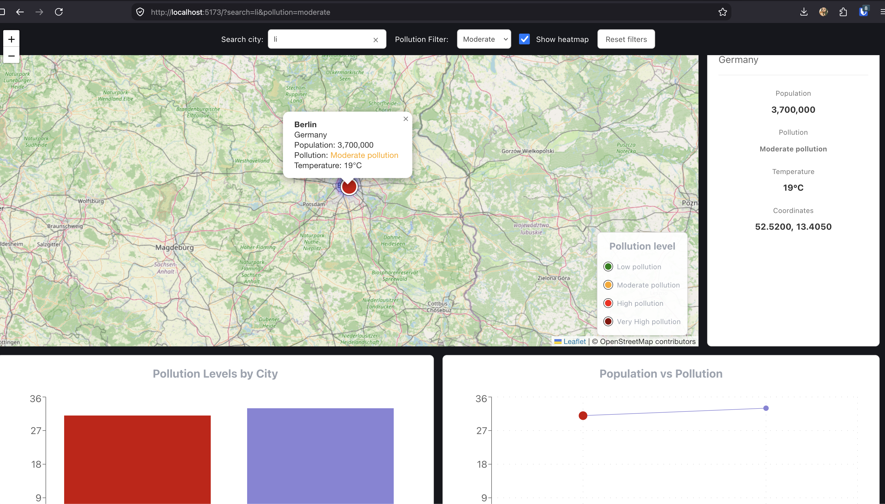

# GeoPulse

`GeoPulse` is a `React-based` interactive city data dashboard that combines `maps`, `data visualization`, `filtering` and `shared application state` into a responsive user experience.

The project is built as a practical frontend engineering exercise, with an emphasis on clean `component architecture`, `reusable hooks`, `state management`, `server-state management` and interactive data visualization.

## Screenshots






## Features

### Interactive map

- Interactive world map powered by `Leaflet`
- City markers with pollution-level visualization
- Selected city highlighting
- Automatic map navigation to the selected city
- City information popups
- Pollution `heatmap`
- Heatmap toggle
- Map legend

### Filtering & search

- Pollution-level `filtering`
- City `search`
- `Debounced` search input
- Clear search action
- `Reset` all filters
- Filter `state` synchronized with the `URL`
- Filters affect map markers, heatmap and charts consistently

### City details

Selecting a city displays:

- City name and country
- Population
- Pollution level
- Temperature
- Geographic coordinates

### Dashboard statistics

The dashboard currently provides:

- Total number of cities
- Average pollution
- Highest-pollution city
- Average temperature

### Data visualization

- Interactive pollution chart
- Responsive chart layout
- Desktop and mobile-specific chart orientation
- Selected city synchronization between chart and map

### Responsive UI

The dashboard adapts to different screen sizes, including:

- Responsive map height
- Responsive dashboard statistics
- Responsive city details
- Responsive charts
- Mobile-friendly filter layout

## Tech Stack

### Core

- React
- TypeScript
- Vite

### State management

- Zustand — client/application state
- TanStack Query — server state, data fetching and caching

### Routing

- React Router

### Maps

- Leaflet
- React Leaflet
- leaflet.heat

### Data visualization

- Recharts

### Data & API

- `TanStack Query` — server state, data fetching and caching
- `MSW` (Mock Service Worker) — API mocking

### Styling

- CSS
- Responsive CSS media queries

### Development

- ESLint
- Yarn

## Architecture

The application follows a component-based architecture with a separation between UI components, application state, server state, domain types and reusable utilities.

```text
src/
├── components/
│   ├── Dashboard/
│   ├── Map/
│   └── ...
│
├── constants/
│
├── hooks/
│
├── layouts/
│
├── pages/
│
├── store/
│   ├── dashboardStore.ts
│   └── mapStore.ts
│
├── types/
│
└── utils/
```

The project intentionally keeps business logic outside presentational components where practical.

For example, city filtering is handled through reusable filtering functions and the `useFilteredCities` hook rather than being implemented independently by the map and chart.

## State Management

GeoPulse uses `Zustand` for client-side dashboard state.

Current dashboard state includes:

- Selected city
- Pollution filter
- Search query

Map-specific state includes:

- Heatmap visibility

The application separates client state from server state:

```text
API
 │
 ▼
TanStack Query
 │
 ▼
City data
 │
 ├───────────────┐
 ▼               ▼
Filtering       Dashboard
 │               │
 ▼               ▼
Map             Statistics
 │
 └──────► Chart
```

## Search & Filtering

Filtering is performed as a composable pipeline:

```text
Cities
  │
  ▼
Pollution filter
  │
  ▼
Search filter
  │
  ▼
Filtered cities
  │
  ├── Map markers
  ├── Heatmap
  └── Pollution chart
```

The search input uses a 300ms debounce to prevent unnecessary filtering updates while the user is typing.

## URL State

Shareable dashboard `state` is synchronized with the `URL`.

For example:

```text
/?search=london&pollution=high
```

The URL can therefore be used to:

- `Preserve` filters after a page refresh
- `Share` a filtered dashboard view
- Create deep links to specific dashboard configurations

The URL acts as the source of truth for shareable filter state during application initialization, while Zustand manages the runtime state.

## API & Mocking

GeoPulse uses MSW (Mock Service Worker) to intercept API requests during
development and provide realistic mock responses.

This keeps API mocking separate from the application's data-fetching logic
and allows TanStack Query to interact with the mocked API as it would with
a real backend.

```text
UI
 │
 ▼
TanStack Query
 │
 ▼
API request
 │
 ▼
MSW
 │
 ▼
Mock API response
```

## Getting Started

### Prerequisites

- Node.js
- Yarn

### Installation

Clone the repository and install dependencies:

```bash
yarn install
```

### Development

Start the development server:

```bash
yarn dev
```

The application will be available at the local development URL provided by Vite.

### Production build

```bash
yarn build
```

### Preview production build

```bash
yarn preview
```

### Lint

```bash
yarn lint
```

## Roadmap

The project is intentionally being developed incrementally.

### Planned features

- [ ] Country filter
- [ ] Selected city synchronization with URL
- [ ] LocalStorage-based user preferences
- [ ] Dark mode / theme system
- [ ] Additional dashboard analytics
- [ ] Additional data visualizations
- [ ] Marker clustering
- [ ] Unit and component testing
- [ ] Performance profiling and optimization
- [ ] Real API integration
- [ ] Pagination / server-side filtering
- [ ] Real-time city data updates
- [ ] WebSocket integration
- [ ] Saved/favorite cities
- [ ] Authentication and user-specific preferences

### Future engineering improvements

- [ ] Improve accessibility
- [ ] Add keyboard navigation where appropriate
- [ ] Improve loading and empty states
- [ ] Add automated testing to the main user flows
- [ ] Evaluate rendering performance with large datasets
- [ ] Improve error handling and API resilience
- [ ] Add CI pipeline
- [ ] Add production deployment configuration

## Project Goals

GeoPulse is intended to explore practical frontend engineering concepts rather than simply demonstrate individual technologies.

The project focuses on:

- React component architecture
- TypeScript domain modeling
- Client-state management
- Server-state management
- Interactive maps
- Data visualization
- Reusable hooks and utilities
- URL-driven application state
- Responsive UI design
- Performance considerations
- Testing
- Real-time data handling

## License

This project is licensed under the MIT License.

See the `LICENSE` file for more information.

## Author

Developed as a frontend engineering project using React, TypeScript and modern frontend development practices.